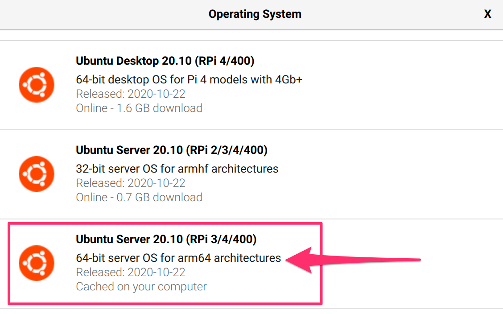
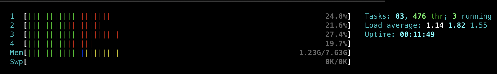

# Running Knative on Raspberry Pi

Setup Knative on Raspberry Pi in 5 minutes

## Hardware

- Get [Raspberry 4](https://www.raspberrypi.org/products/raspberry-pi-4-model-b/?resellerType=home), pick one that has 2GB or more of RAM. I would recommend getting the 8GB.
- Accesories:
    - Micro SD Card
    - Raspberry Power Supply (USB-C)
- Extras:
    - Fan, heat sinks, case

## Setup Operating System (OS)

This instructions are based on [Ubuntu Post](https://ubuntu.com/tutorials/how-to-install-ubuntu-on-your-raspberry-pi#1-overview)

- You will need a 64 bit OS, you can use Ubuntu or Raspberry OS. I will be using Ubuntu 20.10 64bit
- Get an application to image the OS into the SD Card, you can use RaspBerry Imager or any other tool. Choose [MacOS](https://downloads.raspberrypi.org/imager/imager.dmg) or [Windows](https://downloads.raspberrypi.org/imager/imager.exe)
1. Scroll down and Select Ubuntu Server 20.10 64bit (RPi 3/4/400) (Do not select Desktop)
    
2. Select SD Card
3. WRITE
4. WAIT for ~10 minutes

Configure some environment variables based on your operating system, you can use the template provided
```bash
cp template.env .env
```
Enter the values based on your Operating system in to the `.env` file
```
BOOT_DRIVE=/Volumes/system-boot/
WIFI_SSID=SSID
WIFI_PASSWORD=PASSWORD
```
Load the environment variables
```bash
source .env
```

### Enable cgroups for the kernel

Enable cgroups for the kernel by appending to the `cmdline.txt` file
- Append to the one line, do not add a new line, a backup copy `cmdline.txt.bak` is made.

```bash
source .env
sed -i .bak 's/$/ cgroup_memory=1 cgroup_enable=memory/' ${BOOT_DRIVE}/cmdline.txt
cat ${BOOT_DRIVE}/cmdline.txt
```

### Configure Network

After the SD Card is imaged, remove the card and re-insert.
The boot filesystem should be visible from example on MacOS under `/Volumes/system-boot/`

Create a file `network-config` with the wifi info, replace the values for SSID and PASSWORD below
```bash
source .env
cp ${BOOT_DRIVE}/network-config ${BOOT_DRIVE}/network-config.bak
cat <<EOF >${BOOT_DRIVE}/network-config
version: 2
ethernets:
  eth0:
    dhcp4: true
    optional: true
wifis:
  wlan0:
    dhcp4: true
    optional: true
    access-points:
      ${WIFI_SSID}:
        password: "${WIFI_PASSWORD}"
EOF
```

### Boot up

Umount/Eject SD Card from your computer, insert into raspberry pi and power on the raspberry pi.

You can discover the IP via your router, or plug a monitor and keyboard and use the command `ip a` to get the ip address.

You can also use a network scan
```sh
nmap -sn 192.168.7.0/24
```

This would be something like `192.168.x.x` in my case is `192.168.7.217`

Update the file `.env`
```
IP=192.168.7.217
```

### Setup ssh

Check if you have a local ssh, if not then create a new one with `ssh-keygen`
```bash
ls ~/.ssh/id_rsa*
```

If you have more than one ssh key you can use `-i` to be sure it picks the correct one.
```bash
source .env
ssh-copy-id -i $HOME/.ssh/id_rsa ubuntu@$IP
```

If you get prompted for the password use `ubuntu` you would be ask to change it to a new one.

Now you can ssh into the pi without a password
```bash
source .env
ssh ubuntu@$IP uname -m
```
It should print `aarch64` to indicate arm64


## Install Kubernetes

Install the [k3sup](https://github.com/alexellis/k3sup#download-k3sup-tldr) command line tool, check that you have latest version I'm using `0.9.7`
```bash
k3sup version
```

Run the following command to install k3s on the pi as a master node.
```
source .env
k3sup install \
  --ip $IP \
  --user ubuntu \
  --merge \
  --local-path $HOME/.kube/config \
  --context knative-pi \
  --k3s-channel latest \
  --k3s-extra-args '--disable=traefik'
```

- The `--ip` specifies the IP Address to ssh in to the pi
- The `--user` specifies the user to ssh as
- The `--merge` specified to merge the kubeconfig of the new cluster into an existing kubeconfig file
- The `--local-path` specifies which file to write the kubeconfig file, in our case specify an existing one to merge in the new config
- The `--context` specifies the context for the cluster when you use `kubectl` or `kn`
- The `--k3s-channel` specifies which version of kubernetes to install
- The `--k3s-extra-args` with `--disable=traefik` is to avoid the installation of `traefik` as we are going to use `knative` networking

- If you ever need to recover the kubeconfig from the cluster you can use the flag `--skip-install1`
```
source .env
k3sup install \
  --ip $IP \
  --user ubuntu \
  --merge \
  --local-path $HOME/.kube/config \
  --context knative-pi \
  --skip-install
```

## Verify Kubernetes installed

1. switch your context using [kubectx](https://github.com/ahmetb/kubectx)
    ```bash
    kubectx knative-pi
    ```
1. List the nodes
    ```bash
    kubectl get nodes -o wide
    ```
3. The output should look like this
    ```
    NAME     STATUS   ROLES    AGE   VERSION        INTERNAL-IP     EXTERNAL-IP   OS-IMAGE       KERNEL-VERSION     CONTAINER-RUNTIME
    ubuntu   Ready    master   54m   v1.19.3+k3s2   192.168.7.218   <none>        Ubuntu 20.10   5.8.0-1006-raspi   containerd://1.4.0-k3s1
    ```

## Install Knative

I will be using the pre-release build and [install instructions](https://knative.dev/development/install/any-kubernetes-cluster/) since the next version of knative `0.19` is not released yet that contains support for arm64

1. Install Knative Serving
    ```bash
    kubectl apply -f https://storage.googleapis.com/knative-nightly/serving/latest/serving-crds.yaml

    kubectl apply -f https://storage.googleapis.com/knative-nightly/serving/latest/serving-core.yaml

    kubectl wait deployment --all --timeout=-1s --for=condition=Available -n knative-serving
    ```
1. Install Contour but replace the version of envoy to `v1.16.0` as the version that supports arm64
    ```bash
    curl -s -L https://storage.googleapis.com/knative-nightly/net-contour/latest/contour.yaml | \
    sed "s/envoy:v1.15.1/envoy:v1.16.0/g" | \
    kubectl apply -f -
    kubectl wait deployment --all --timeout=-1s --for=condition=Available -n contour-external
    kubectl wait deployment --all --timeout=-1s --for=condition=Available -n contour-internal
    ```
1. Install the Knative Network Controller:
    ```bash
    kubectl apply --filename https://storage.googleapis.com/knative-nightly/net-contour/latest/net-contour.yaml
    kubectl wait deployment contour-ingress-controller --timeout=-1s --for=condition=Available -n knative-serving
    ```
1. To configure Knative Serving to use previous installed Network Controller by default:
    ```bash
    kubectl patch configmap/config-network \
    --namespace knative-serving \
    --type merge \
    --patch '{"data":{"ingress.class":"contour.ingress.networking.knative.dev"}}'
    ```
1. Set the environment variable `EXTERNAL_IP` to External IP Address of the Worker Node
    ```bash
    EXTERNAL_IP="$(kubectl get svc envoy -n contour-external  -o=jsonpath='{.status.loadBalancer.ingress[0].ip}')"
    echo EXTERNAL_IP==$EXTERNAL_IP
    ```
1. Set the environment variable `KNATIVE_DOMAIN` as the DNS domain using `nip.io`
    ```bash
    KNATIVE_DOMAIN="$EXTERNAL_IP.nip.io"
    echo KNATIVE_DOMAIN=$KNATIVE_DOMAIN
    ```
    Double check DNS is resolving
    ```bash
    dig $KNATIVE_DOMAIN
    ```
1. Configure DNS for Knative Serving
    ```bash
    kubectl patch configmap -n knative-serving config-domain -p "{\"data\": {\"$KNATIVE_DOMAIN\": \"\"}}"
    ```
1. Verify that Knative is Installed properly all pods should be in `Running` state and our `contour-external` service configured.
    ```bash
    kubectl get pods -n knative-serving
    kubectl get svc  -n contour-external
    kubectl get svc  -n contour-internal
    ```

## Deploy Knative Application

Deploy using Knative CLI [kn](https://github.com/knative/client):
```bash
kn service create hello --port 8080 --image csantanapr/helloworld-go:latest
```

**Optional:** Deploy a Knative Service using a yaml manifest:
```bash
cat <<EOF | kubectl apply -f -
apiVersion: serving.knative.dev/v1
kind: Service
metadata:
  name: hello
spec:
  template:
    spec:
      containers:
      - image: csantanapr/helloworld-go:latest
        ports:
        - containerPort: 8080
        env:
        - name: TARGET
          value: "Knative"
EOF
```

Wait for Knative Service to be Ready
```bash
kubectl wait ksvc hello --all --timeout=-1s --for=condition=Ready
```

Get the URL of the new Service
```bash
SERVICE_URL=$(kubectl get ksvc hello -o jsonpath='{.status.url}')
echo $SERVICE_URL
```

Test the App
```bash
curl $SERVICE_URL
```

Output should be:
```
Hello World from Golang!
```

Check the knative pods that scaled from zero
```
kubectl get pod -l serving.knative.dev/service=hello
```

Output should be:
```
NAME                                      READY   STATUS    RESTARTS   AGE
hello-00001-deployment-68bb96f946-wfzxc   2/2     Running   0          93s
```

Try the service `url` on your browser (command works on linux and macos)
```bash
open $SERVICE_URL
```

You can watch the pods and see how they scale down to zero after http traffic stops to the url
```
kubectl get pod -l serving.knative.dev/service=hello -w
```

Output should look like this:
```
NAME                                     READY   STATUS
hello-00001-deployment-68bb96f946-wfzxc   2/2     Running
hello-00001-deployment-68bb96f946-wfzxc   2/2     Terminating
hello-00001-deployment-68bb96f946-wfzxc   1/2     Terminating
hello-00001-deployment-68bb96f946-wfzxc   0/2     Terminating
```

Try to access the url again, and you will see a new pod running again.
```
NAME                                     READY   STATUS
hello-r4vz7-deployment-c5d4b88f7-rr8cd   0/2     Pending
hello-r4vz7-deployment-c5d4b88f7-rr8cd   0/2     ContainerCreating
hello-r4vz7-deployment-c5d4b88f7-rr8cd   1/2     Running
hello-r4vz7-deployment-c5d4b88f7-rr8cd   2/2     Running
```

Some people call this **Serverless** 🎉 🌮 🔥


If you want to see how much CPU and Memory all the pods are consuming use `kubectl top`
```
kubectl top pods -A --sort-by=cpu
NAMESPACE          NAME                                          CPU(cores)   MEMORY(bytes)
knative-serving    webhook-c76796d6f-4rh2n                       52m          13Mi
knative-serving    controller-7f6d88c75b-bmm5v                   29m          24Mi
knative-serving    autoscaler-b57c65d47-w8rs6                    21m          16Mi
contour-external   envoy-rqbd4                                   14m          25Mi
kube-system        coredns-66c464876b-nttx5                      12m          8Mi
contour-internal   envoy-kvk8d                                   12m          25Mi
knative-serving    contour-ingress-controller-5fdd4b6f94-hrqth   8m           14Mi
kube-system        metrics-server-7b4f8b595-6zbrf                6m           13Mi
contour-internal   contour-6b84898d48-rtw9j                      5m           19Mi
knative-serving    activator-5ff578d869-nxm4b                    5m           17Mi
contour-external   contour-5fd57c546b-2lgsl                      4m           19Mi
kube-system        local-path-provisioner-7ff9579c6-tph2s        4m           7Mi
contour-external   contour-5fd57c546b-qlxbm                      3m           29Mi
contour-internal   contour-6b84898d48-r77lj                      2m           16Mi
contour-external   svclb-envoy-wqwxm                             0m           3Mi
default            hello-00001-deployment-6d8674c767-2zx86       0m           2Mi
```
And this is what htop shows



## Build your containers with multi architectures

I have two sample applications in `apps/` one for `go` and one for `nodejs`

#### Build arm64 container image for go

1. Install `ko` version `v0.6.0`+ from https://github.com/google/ko
1. Setup your docker registry info, replace the value of `DOCKER_HUB_USER`
    ```bash
    export DOCKER_HUB_USER=csantanapr
    export KO_DOCKER_REPO="docker.io/${DOCKER_HUB_USER}"
    ```
1. change directory to the root of the go app
    ```bash
    cd apps/helloworld-go
    ```
1. Publish container image for all architecture types including `arm64`
    ```bash
    ko publish --platform=all -B .
    ```
1. Deploy as Knative service
    ```bash
    kn service create helloworld-go --image ${KO_DOCKER_REPO}/helloworld-go
    ```
1. Run the app
    ```bash
    curl $(kn service describe helloworld-go -o url)
    ```

### Build arm64 container image for nodejs

1. Install Docker-Desktop with experimental enable follow instructions here https://www.docker.com/blog/multi-arch-images/
1. Create a new builder if you don't have one already
    ```bash
    docker buildx create --name mybuilder
    ```
1. Configure your docker registry
    ```bash
    export DOCKER_HUB_USER=csantanapr
    ```
1. change directory to the root of the go app
    ```bash
    cd apps/helloworld-nodejs
    ```
1. Build and Push the image
    ```bash
    docker buildx build \
     -t ${DOCKER_HUB_USER}/helloworld-nodejs:latest \
     --platform linux/amd64,linux/arm64 \
     --push .
    ```
1. Deploy as Knative service
    ```bash
    kn service create helloworld-nodejs --image docker.io/${DOCKER_HUB_USER}/helloworld-nodejs
    ```
1. Run the app
    ```bash
    curl $(kn service describe helloworld-nodejs -o url)
    ```

### Delete Cluster
Uninstall kubernetes
```
ssh ubuntu@$IP sudo /usr/local/bin/k3s-uninstall.sh
```
If you have any issues with this instructions [open an new issue](https://github.com/csantanapr/knative-pi/issues/new) please 🙏🏻


## Related Posts
- https://blog.alexellis.io/test-drive-k3s-on-raspberry-pi/
- https://blog.alexellis.io/raspberry-pi-homelab-with-k3sup/
- https://itsmurugappan.medium.com/knative-on-raspberry-pi-1106984de5b8
